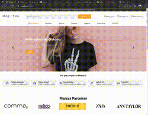

<h2>Desafio Landing Page da Maeztra</h2>

<h3>Apresentação do Projeto</h3>



<h3>Descrição</h3>

<p>Desenvolvimento de uma landing page ecommerce da empresa maeztra para um teste de vaga</p>

## :rocket: Tecnologias

- [React](https://pt-br.reactjs.org/)
- [HTML5](https://developer.mozilla.org/pt-BR/docs/Web/HTML/HTML5)
- [SASS](https://sass-lang.com/)

<div id="requisitos">

## :white_check_mark: Requisitos

<p>Antes de executar :checkered_flag:, você precisar ter o <a href="https://git-scm.com">[Git]</a> e o <a href="https://nodejs.org/pt-br/">[Node]</a> instalados.</p>

## :checkered_flag: Executando

```bash

# Clone este projeto
$ git clone https://github.com/guisantanaa/layout-maeztra

# Entre na pasta corebiz-ecommerce
$ cd layout-maeztra
$ Execute o comando 'code .' e o projeto sera aberto no Visual Studio Code

# Instale as dependências
$ yarn

# Inicialize
$ yarn dev

# Abra o seu navegador em http://localhost:3000

```

<h3>Link de deploy da aplicação</h3>

<a href="https://guisantanaa.github.io/layout-maeztra/" target="_blank">Link</a>
